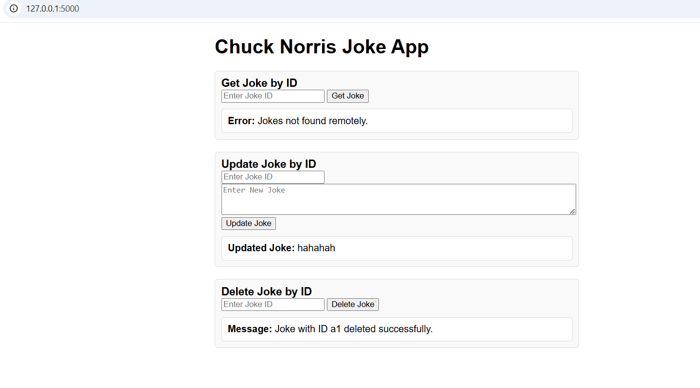
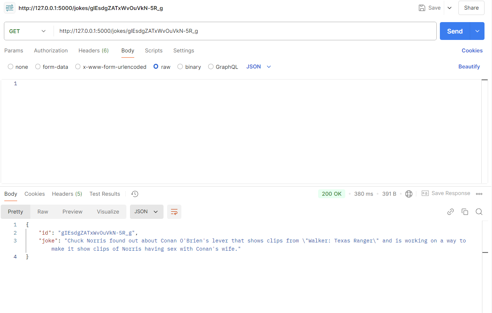

## Description: Designing and implementing a minimalistic flask API application to search, create, delete and update jokes from Chuck Norris jokes
## Author: Mahalakshmi Ullas

## Overview
The Flask API is a RESTful service that allows users to manage tasks in a to do list application. The API supports operations such as creating, reading, updating and deleting tasks. I have implemented 5 endpoints(GET(id), GET(text free search), POST(new joke), PUT(id), DELETE(id)) using Chuck Norris API in Flask. Implemented User Interface using html to get, update, delete jokes. 

## Architecture 
Designed using REST API as it has basic HTTP principles which makes it much more portable across heterogeneous platforms, it has faster performance, can be used in different formats like JSON, more efficient. 
ChuckNorris_assignment/
│
├── app.py                  # Main application file
├── routes/
│   ├── __init__.py         # Blueprint registration
│   ├── insert_endpoint.py  # View and route definition
|   ├── update_endpoint.py  # View and route definition
│   └── templates/          # Template folder for Blueprint
│       └── index.html      # HTML template
├── .gitattributes.txt  
├── .gitignore.txt          
├── local_jokes.json        # Local jokes
├── localjokes_file.json    # Local jokes 
├── COMMENTS.md             # Steps

I choose to use Blueprints as it allows us to break up application into smaller, logically grouped components(modules). Each blueprint can contain its own routes, views, templates, and static files. This is particularly useful when application grows, as it helps in keeping the codebase clean and organized. I have used files to get, store, update, delete jokes locally and get to fetch jokes remotely. 

## Technologies
Flask - To develop API as it is 
Postman - To test the endpoints 
Python - Language to develop API endpoints
Python Extensions - requests
HTML - To design User Interface
Javascript - To dynamic change the content

## Dependencies
1. flask - For building the API and handling HTTP requests and responses.
2. requests - Used to make HTTP request to other sites, usually APIs. 
3. json - Used to handle JSON data in your application, particularly for reading and saving jokes to/from a file
4. blueprints - Used to structure the Flask application into different components, making structuring the application based on different functionality
5. request - It is a object that allows you to access the data sent from the user to the server and pass the data into your Flask Application
6. jsonify - It alows easily to return JSON-formatted data from your route handlers

## Endpoints
1. POST = http://127.0.0.1:5000/api/jokes
Implemented endpoint to create joke locally.

2. GET(free text search) = http://127.0.0.1:5000/search?query={value}
Implemented free text search endpoint by considering locally and remotely

3. GET(unique id) = http://127.0.0.1:5000/joke/{id} 
Implemented endpoint to retrieve a joke by unique id by considering locally and remotely

4. PUT(update by unique id) = http://127.0.0.1:5000/joke/{id} 
Implemented endpoint to update a joke by unique id. If the joke does not exist, returning 404 not found. If it exists storing the updated version locally and getting the lastest version.

5. DELETE(delete by unique id) = http://127.0.0.1:5000/joke/{id} 
Implemented endpoint to delete a joke by unique id. If the joke does not exist, returning 404 not found. If it exists deleting the updated version locally and getting the lastest version.

## Testing results

## How to run the application
1. python -m venv venv                      (to create an virtual environment)
2. .\venv\Scripts\activate                  (to activate) 
3. python -m pip install flask              (to install flask)
4. python -m pip install requests
5. flask run                                (to run flask in powershell/env and in app.py we need not specify any port)
            or
   python app.py                            (to run flask in python normal terminal and in app.py we need to specify any port number)
6. deactivate                               (if its running in environment)
